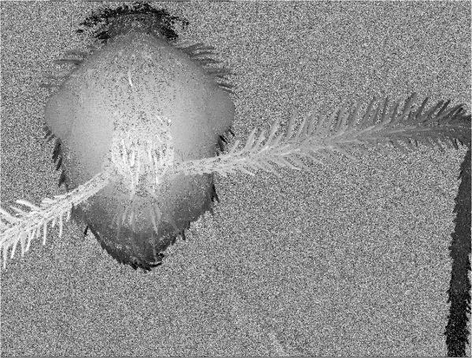

# Focus Stacking
The goal of this project was to implement an algorithm combining multiple
images taken at different focus distances to give a resulting image
a greater depth of field than any of individual source images. More can be
read at [Wikipedia](https://en.wikipedia.org/wiki/Focus_stacking).

# Requirements
The projects was created in modern c++11, according to [Google style guide](https://google.github.io/styleguide/cppguide.html),
Additional libraries(Boost, OpenCV) were only used to list all images and load them.
For formatting and style checking clang-format and cpplint were used.

# Setup
Clone the repo, download the images(see Images section) and build from sources using cmake.
```bash
mkdir build
cd build
cmake ..
make

# Run program - it will save two images
../bin/focus_stacking <path_to_directory_with_images>

# Run test
ctest -VV
```
In addition the program allows for testing influence of different parameters on
the final result:
* edge_detection_method - Laplacian or Sobel
* selected_channel - pick which channel(R, G, B) should be used when computing weights
* edge_threshold - below this value pixels are treated as blurred on all images and counted as background
* not_defined_depth_margin - separates colors from background to other pixels

They can be provided when creating an instance of FocusStacking class
or set later. For example see PerformTests() method in main.cpp

# Images
Images used in testing project can be downloaded from [here](http://grail.cs.washington.edu/projects/photomontage/data/bug.zip).
Below there are a few examples:


And the expected result:


# Algorithms
## Sharp image
1. Load all images from provided directory
2. Perform Gaussian blur on them
3. Detect Edges using one of available methods(Laplacian or Sobel)
4. Create blank result image
5. Loop for all responses picking the pixel from the image, where
edge is the strongest and putting it to result image

Acquired result:


## Depth map
1. Create blank depth image
2. Assign values from 255 to 0(divided evenly) for images, from the closest to the farthest
3. Loop for all responses picking the color corresponding the pixel from the image, where
   edge is the strongest and put it to depth image

First try depth map:



As you can see it's not too great, with a lot of noise. That's why I decided
to add one more bucket for pixels which are blurred on all images. Additionally
I have created a margin, which separates background from pixels which are
sharp on some image. After those operations depth looks like this:


# Bonus
3D gif created using [depthy](http://depthy.me)

